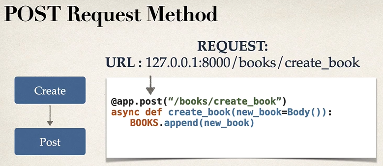

# Entornos virtuales
- Entorno aislado de Python 
- pip es un gestor de dependencias de python
# 
- Creamos una carpeta para el proyecto
- Revisamos que tengamos todas las dependencias necesarias
- creamos el entorno virtual
- y activamos el entorno
# 
- pip list . nos mostrara lo que tenemos instalado
# Nos vamos a la carpeta donde crearemos el entorno virtual
- python -m venv fastapienv  - Creamos el entorno y la carpeta fastapienv
- [carpeta]\Scripts\activate - activamos el entorno
- deactivate - desactivamos el entorno
- pip install fastapi - instalamos FastAPI
- pip install "uvicorn[standard]" - descargamos el servidor

# Primer Proyecto
- Crearemos un CRUD
# CRUD      - HTTP Request Methods
- Create    - POST
- Read      - GET   
- Update    - PUT
- Delete    - DELETE

- uvicorn books:app --reload - Cargamos nuestra app al servidor (books es el nombre de el archivo)[app es como llamamos a FastAPI]{ -- reload para que cada que hagamos cambios se recarguen}
- se puede usar tambien ( fastapi run dev books.py) que es una manera rapida de hacerlo
- si usamos ssin el dev igual se puede, pero es mas usado para produccion

# Parametros de ruta
- Son parametros de peticion que se han adjuntado a la URL
- Forma de encontrar informacion basada en la ubicacion

# Parametros de consulta
- son parametros de peticion que se han adjuntado despues de un signo de interrogacion
- tienen una relacion de par name=value

# Metodo POST
- CREAR DATOS

